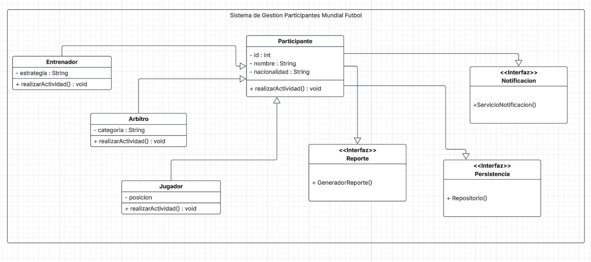

# Taller Grupal - Principios SOLID
- **Integrantes:** Fabio Tapia, Jhostin Molina y Emilia Peña. 

### **Objetivo:** Diseñar e implementar un sistema orientado a objetos aplicando los principios SOLID para mejorar la mantenibilidad, reutilización y escalabilidad del software.
### **Contexto del Problema:** La organización del Mundial de Fútbol necesita desarrollar un sistema para gestionar los procesos del torneo. El sistema debe administrar:
- Participantes
- Registro de actividades
- Reportes
- Notificaciones
- Almacenamiento de información
## Diagrama UML


# Estructura del Proyecto

El proyecto está formado por las siguientes clases e interfaces:

## Clases

- Participante
- Jugador
- Entrenador
- Arbitro
- ReportePDF
- ReporteExcel
- Correo
- WhatsApp
- BaseDatos
- Archivo
- GestorMundial
- Main

## Interfaces

- Reporte
- Notificacion
- Persistencia

---

# Explicación del Código

## 1. Clase Participante

Es la clase padre del sistema.

Contiene los atributos comunes que poseen todos los participantes del Mundial.

```java
private int id;
private String nombre;
private String nacionalidad;
```

También posee los métodos getters y el método:

```java
mostrarInfo()
```

que imprime la información básica del participante.

### Encapsulamiento

Los atributos son privados.

Esto impide que otras clases modifiquen directamente los datos y obliga a utilizar métodos para acceder a ellos.

### Principio SOLID aplicado

## SRP (Single Responsibility Principle)

La única responsabilidad de esta clase es representar un participante.

No genera reportes.

No envía notificaciones.

No guarda archivos.

Solo administra los datos del participante.

---

# 2. Clases Jugador, Entrenador y Arbitro

Estas clases heredan de Participante.

Cada una agrega un atributo propio.

Jugador

```java
private String posicion;
```

Entrenador

```java
private String especialidad;
```

Arbitro

```java
private String categoria;
```

Cada clase sobrescribe el método

```java
mostrarInfo()
```

para mostrar también su información específica.

### Herencia

Estas clases reutilizan todos los atributos y métodos de Participante.

Gracias a ello no es necesario repetir código.

### Polimorfismo

Aunque una variable sea de tipo Participante, puede almacenar un Jugador, un Entrenador o un Arbitro.

Ejemplo:

```java
Participante jugador = new Jugador(...);
```

Cuando se llama

```java
jugador.mostrarInfo();
```

Java ejecuta automáticamente el método correspondiente al objeto real.

### Principios SOLID

### LSP (Liskov Substitution Principle)

Cualquier Jugador, Entrenador o Arbitro puede utilizarse donde se espere un Participante.

El programa sigue funcionando correctamente sin importar el tipo concreto del objeto.

### OCP (Open/Closed Principle)

Si en el futuro se desea agregar una nueva clase como:

```java
Medico
```

o

```java
Comentarista
```

solo es necesario crear una nueva clase que herede de Participante.

No es necesario modificar el código existente.

---

# 3. Interfaces

El proyecto utiliza tres interfaces.

## Reporte

```java
public interface Reporte
```

Define el método

```java
generarReporte()
```

---

## Notificacion

```java
public interface Notificacion
```

Define el método

```java
enviar()
```

---

## Persistencia

```java
public interface Persistencia
```

Define el método

```java
guardar()
```

### Principio SOLID

## ISP (Interface Segregation Principle)

Cada interfaz tiene una única función.

Una clase solo implementa la interfaz que necesita.

Esto evita crear interfaces demasiado grandes con métodos innecesarios.

---

# 4. Implementaciones

Cada interfaz posee dos implementaciones.

## Reporte

- ReportePDF
- ReporteExcel

## Notificacion

- Correo
- WhatsApp

## Persistencia

- BaseDatos
- Archivo

Cada clase implementa únicamente los métodos definidos por su interfaz.

Ejemplo:

```java
public class ReportePDF implements Reporte
```

### Principio SOLID

## OCP

Si se desea agregar

- ReporteWord
- Telegram
- Nube

solo se crea una nueva clase.

El resto del sistema continúa funcionando sin modificaciones.

---

# 5. Clase GestorMundial

Es la clase principal del sistema.

Se encarga de:

- Registrar participantes.
- Mostrar participantes.
- Generar reportes.
- Enviar notificaciones.
- Guardar información.

Internamente posee una lista:

```java
ArrayList<Participante>
```

donde se almacenan todos los participantes registrados.

---

## Dependency Injection

El constructor recibe:

```java
Reporte

Notificacion

Persistencia
```

No crea estos objetos dentro de la clase.

Simplemente los recibe.

---

## Principio SOLID

### DIP (Dependency Inversion Principle)

GestorMundial depende de interfaces y no de clases concretas.

Correcto

```java
Reporte reporte = new ReportePDF();
```

Incorrecto

```java
ReportePDF reporte = new ReportePDF();
```

Gracias a esto es posible cambiar ReportePDF por ReporteExcel sin modificar GestorMundial.

---

# 6. Clase Main

Main es el punto de inicio del programa.

Aquí ocurre toda la ejecución.

Primero se crean las implementaciones.

```java
Reporte reporte = new ReportePDF();

Notificacion notificacion = new Correo();

Persistencia persistencia = new BaseDatos();
```

Después se crea el gestor.

```java
GestorMundial gestor =
new GestorMundial(reporte,
notificacion,
persistencia);
```

Luego se crean los participantes.

```java
Jugador

Entrenador

Arbitro
```

Se registran mediante

```java
registrarParticipante()
```

Finalmente se ejecutan las acciones del sistema.

- Mostrar participantes.
- Generar reporte.
- Enviar notificación.
- Guardar información.

---

# Flujo de Ejecución

1. Inicia Main.
2. Se crean las implementaciones de Reporte, Notificacion y Persistencia.
3. Se crea GestorMundial.
4. Se crean los participantes.
5. Se registran en la lista.
6. Se muestran todos los participantes.
7. Se genera un reporte.
8. Se envía una notificación.
9. Se guarda la información.

---

# Aplicación de los Principios SOLID

## SRP

Cada clase posee una única responsabilidad.

Ejemplos:

- Participante almacena datos.
- ReportePDF genera reportes.
- Correo envía mensajes.
- BaseDatos guarda información.

---

## OCP

El sistema permite agregar nuevas funcionalidades sin modificar el código existente.

Ejemplos:

- ReporteWord
- Telegram
- Medico

---

## LSP

Jugador, Entrenador y Arbitro pueden reemplazar a Participante sin producir errores.

---

## ISP

Las interfaces son pequeñas y específicas.

- Reporte
- Notificacion
- Persistencia

---

## DIP

GestorMundial depende de interfaces y no de implementaciones concretas.

Esto hace que el sistema sea flexible y fácil de mantener.

---

