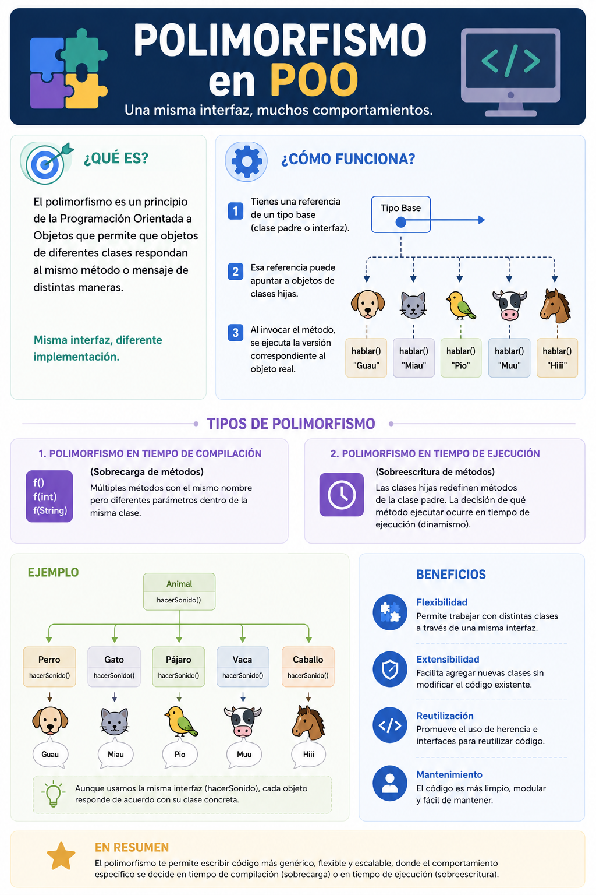
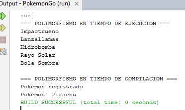

# Polimorfismo 



**Recuerda:** El polimorfismo permite que diferentes objetos respondan al mismo método de formas distintas.

## Ejemplo: 
Todos los pokemones tienen el método `atacar()`, pero cada uno produce un ataque diferente.


---

## Clase Pokemon

```java
public abstract class Pokemon {

    public abstract void atacar();

    // Polimorfismo en tiempo de compilación (sobrecarga)
    public void mostrarInfo() {
        System.out.println("Pokemon registrado");
    }

    public void mostrarInfo(String nombre) {
        System.out.println("Pokemon: " + nombre);
    }
}
```
## Clase Pikachu

```java
public class Pikachu extends Pokemon {

    @Override
    public void atacar() {
        System.out.println("Impactrueno");
    }
}
```

---

## Clase Charizard

```java
public class Charizard extends Pokemon {

    @Override
    public void atacar() {
        System.out.println("Lanzallamas");
    }
}
```

---

# Clase Blastoise

```java
public class Blastoise extends Pokemon {

    @Override
    public void atacar() {
        System.out.println("Hidrobomba");
    }
}
```

---

# Clase Venusaur

```java
public class Venusaur extends Pokemon {

    @Override
    public void atacar() {
        System.out.println("Rayo Solar");
    }
}
```

---

# Clase Gengar

```java
public class Gengar extends Pokemon {

    @Override
    public void atacar() {
        System.out.println("Bola Sombra");
    }
}
```

---

# Clase Main

```java
public class PokemonGo {

    public static void main(String[] args) {

        Pokemon p1 = new Pikachu();
        Pokemon p2 = new Charizard();
        Pokemon p3 = new Blastoise();
        Pokemon p4 = new Venusaur();
        Pokemon p5 = new Gengar();

        System.out.println("=== POLIMORFISMO EN TIEMPO DE EJECUCION ===");

        p1.atacar();
        p2.atacar();
        p3.atacar();
        p4.atacar();
        p5.atacar();

        System.out.println("\n=== POLIMORFISMO EN TIEMPO DE COMPILACION ===");

        p1.mostrarInfo();
        p1.mostrarInfo("Pikachu");
    }
}
```

---

# ¿Dónde encontramos el polimorfismo?

## 1. Polimorfismo en tiempo de compilación

Se produce mediante la sobrecarga de métodos.

```java
mostrarInfo()
mostrarInfo(String nombre)
```

Los métodos tienen el mismo nombre pero diferentes parámetros.

El compilador decide cuál ejecutar.

---

## 2. Polimorfismo en tiempo de ejecución

Se produce mediante la sobreescritura.

```java
Pokemon p1 = new Pikachu();
p1.atacar();
```

Aunque la referencia es de tipo `Pokemon`, Java ejecuta el método de la clase real (`Pikachu`).

Lo mismo ocurre con Charizard, Blastoise, Venosaur y Gengar.

### Resultado

