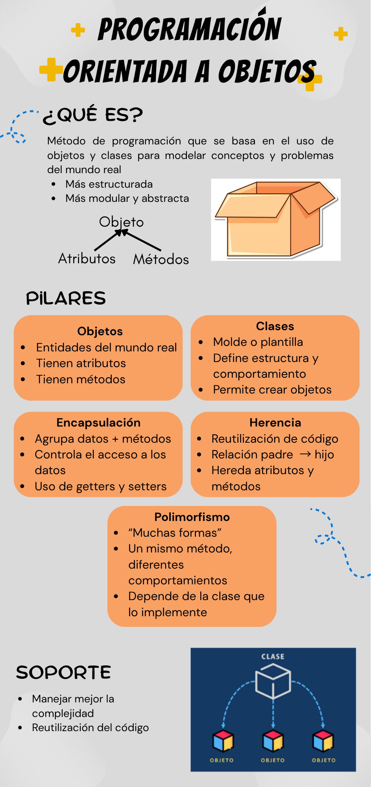

# TALLER: Introducción a la Programación Orientada a Objetos
## Integrantes: Jhostin Molina, Emilia Peña y Fabio Tapia

## ¿Qué es POO?
La POO es un método de programación basado en el uso de objetos y clases para representar y resolver problemas del mundo real. Es más estructurada, modular y abstracta que la programación tradicional.

---

## ¿Cuáles son los pilares fundamentales de la POO?
- Objetos  
- Clases  
- Encapsulación  
- Herencia  
- Polimorfismo  

---

## ¿Cuáles son las definiciones de cada pilar fundamental de la POO?

- **Objetos:** Entidades del mundo real con atributos (datos) y métodos (acciones).  
- **Clases:** Plantillas que definen la estructura y comportamiento de los objetos.  
- **Encapsulación:** Agrupa datos y métodos, controlando el acceso mediante getters y setters.  
- **Herencia:** Permite que una clase herede atributos y métodos de otra.  
- **Polimorfismo:** Un mismo método puede tener diferentes comportamientos según el objeto.  

---

## ¿Por qué los lenguajes orientados a objetos dan soporte a la POO?
Porque permiten organizar el código en objetos, manejar mejor la complejidad, reutilizar código y tomar decisiones en tiempo de ejecución según el tipo de objeto.

---

## ¿En qué contextos es apropiado aplicar cada uno de los pilares fundamentales de la POO?

- **Clases y Objetos:** Para representar situaciones reales (ej: sistemas de nómina o inventarios).  
- **Encapsulación:** Cuando se necesita proteger y controlar el acceso a los datos.  
- **Herencia:** Cuando hay elementos con características comunes pero diferencias específicas.  
- **Polimorfismo:** Cuando se requiere que una misma acción funcione de distintas formas según el objeto.

### Infografía: 

