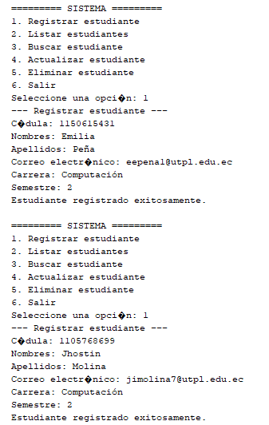
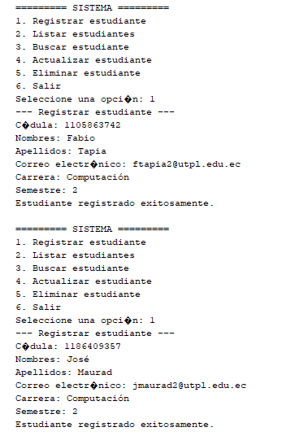
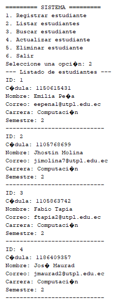
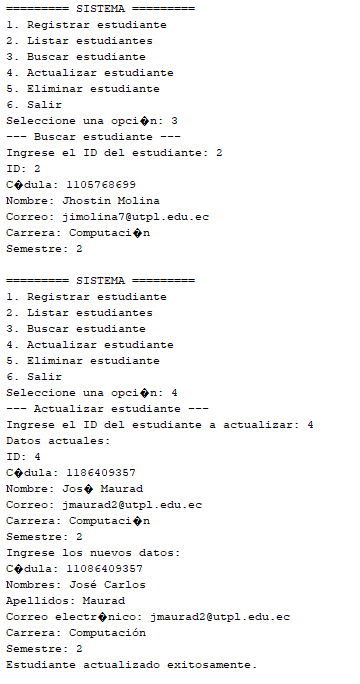
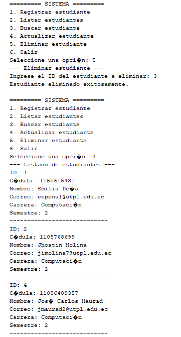
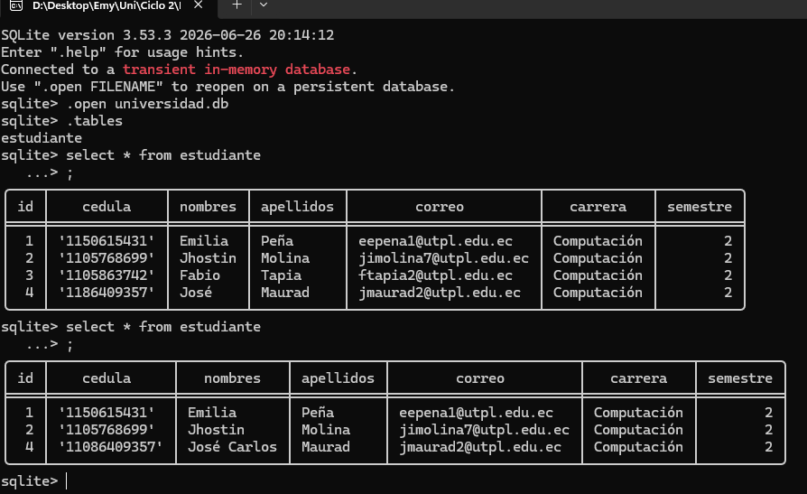

# Taller Base de Datos
- **Integrantes:** José Maurad, Jhostin Molina, Emilia Peña, Fabio Tapia.
## Objetivo:
Desarrollar una aplicación en Java que implemente los principios de Programación Orientada a Objetos y permita gestionar información utilizando una base de datos SQLite mediante operaciones CRUD (Crear, Leer, Actualizar y Eliminar).

## Código fuente:
### Clase principal 

```java

package tallercrud;

import dao.EstudianteDAO;
import modelo.Estudiante;
import java.util.ArrayList;
import java.util.Scanner;

public class TallerCRUD {
    private static final Scanner sc = new Scanner(System.in);
    private static final EstudianteDAO dao = new EstudianteDAO();
    public static void main(String[] args) {
        dao.crearTabla();
        int opcion;
        do {
            mostrarMenu();
            opcion = leerEntero("Seleccione una opción: ");
            switch (opcion) {
                case 1 -> registrarEstudiante();
                case 2 -> listarEstudiantes();
                case 3 -> buscarEstudiante();
                case 4 -> actualizarEstudiante();
                case 5 -> eliminarEstudiante();
                case 6 -> System.out.println("Saliendo del sistema...");
                default -> System.out.println("Opción no válida. Intente nuevamente.");
            }
            System.out.println();
        } while (opcion != 6);
        sc.close();
    }

    private static void mostrarMenu() {
        System.out.println("========= SISTEMA =========");
        System.out.println("1. Registrar estudiante");
        System.out.println("2. Listar estudiantes");
        System.out.println("3. Buscar estudiante");
        System.out.println("4. Actualizar estudiante");
        System.out.println("5. Eliminar estudiante");
        System.out.println("6. Salir");
    }

    private static void registrarEstudiante() {
        System.out.println("--- Registrar estudiante ---");
        String cedula = leerTexto("Cédula: ");
        String nombres = leerTexto("Nombres: ");
        String apellidos = leerTexto("Apellidos: ");
        String correo = leerTexto("Correo electrónico: ");
        String carrera = leerTexto("Carrera: ");
        int semestre = leerEntero("Semestre: ");
        Estudiante estudiante = new Estudiante(cedula, nombres, apellidos, correo, carrera, semestre);
        if (dao.guardar(estudiante)) {
            System.out.println("Estudiante registrado exitosamente.");
        } else {
            System.out.println("No se pudo registrar el estudiante.");
        }
    }

    private static void listarEstudiantes() {
        System.out.println("--- Listado de estudiantes ---");
        ArrayList<Estudiante> lista = dao.listar();
        if (lista.isEmpty()) {
            System.out.println("No hay estudiantes registrados.");
            return;
        }
        for (Estudiante e : lista) {
            System.out.println(e);
            System.out.println("----------------------------");
        }
    }

    private static void buscarEstudiante() {
        System.out.println("--- Buscar estudiante ---");
        int id = leerEntero("Ingrese el ID del estudiante: ");
        Estudiante estudiante = dao.buscarPorId(id);
        if (estudiante == null) {
            System.out.println("No se encontró ningún estudiante con ID " + id + ".");
        } else {
            System.out.println(estudiante);
        }
    }

    private static void actualizarEstudiante() {
        System.out.println("--- Actualizar estudiante ---");
        int id = leerEntero("Ingrese el ID del estudiante a actualizar: ");
        Estudiante estudiante = dao.buscarPorId(id);
        if (estudiante == null) {
            System.out.println("No se encontró ningún estudiante con ID " + id + ".");
            return;
        }
        System.out.println("Datos actuales:");
        System.out.println(estudiante);
        System.out.println("Ingrese los nuevos datos:");
        estudiante.setCedula(leerTexto("Cédula: "));
        estudiante.setNombres(leerTexto("Nombres: "));
        estudiante.setApellidos(leerTexto("Apellidos: "));
        estudiante.setCorreo(leerTexto("Correo electrónico: "));
        estudiante.setCarrera(leerTexto("Carrera: "));
        estudiante.setSemestre(leerEntero("Semestre: "));
        if (dao.actualizar(estudiante)) {
            System.out.println("Estudiante actualizado exitosamente.");
        } else {
            System.out.println("No se pudo actualizar el estudiante.");
        }
    }

    private static void eliminarEstudiante() {
        System.out.println("--- Eliminar estudiante ---");
        int id = leerEntero("Ingrese el ID del estudiante a eliminar: ");
        if (dao.buscarPorId(id) == null) {
            System.out.println("No se encontró ningún estudiante con ID " + id + ".");
            return;
        }
        if (dao.eliminar(id)) {
            System.out.println("Estudiante eliminado exitosamente.");
        } else {
            System.out.println("No se pudo eliminar el estudiante.");
        }
    }

    private static String leerTexto(String mensaje) {
        System.out.print(mensaje);
        return sc.nextLine().trim();
    }

    private static int leerEntero(String mensaje) {
        System.out.print(mensaje);
        while (!sc.hasNextInt()) {
            System.out.print("Ingrese un número válido: ");
            sc.next();
        }
        int valor = sc.nextInt();
        sc.nextLine(); 
        return valor;
    }
}
```

### Clase EstudianteDAO (Package dao)

```java
package dao;

import Clases.ConexionSQLite;
import modelo.Estudiante;
import java.sql.Connection;
import java.sql.PreparedStatement;
import java.sql.ResultSet;
import java.sql.SQLException;
import java.sql.Statement;
import java.util.ArrayList;

public class EstudianteDAO {

    public void crearTabla() {
        String sql = "CREATE TABLE IF NOT EXISTS estudiante (" +
                "id INTEGER PRIMARY KEY AUTOINCREMENT," +
                "cedula TEXT NOT NULL," +
                "nombres TEXT NOT NULL," +
                "apellidos TEXT NOT NULL," +
                "correo TEXT," +
                "carrera TEXT," +
                "semestre INTEGER" +
                ");";

        try (Connection con = ConexionSQLite.conectar();
             Statement stmt = con.createStatement()) {
            stmt.execute(sql);
        } catch (SQLException e) {
            System.out.println("Error al crear la tabla: " + e.getMessage());
        }
    }

    public boolean guardar(Estudiante estudiante) {
        String sql = "INSERT INTO estudiante (cedula, nombres, apellidos, correo, carrera, semestre) " +
                "VALUES (?, ?, ?, ?, ?, ?);";

        try (Connection con = ConexionSQLite.conectar();
             PreparedStatement ps = con.prepareStatement(sql)) {

            ps.setString(1, estudiante.getCedula());
            ps.setString(2, estudiante.getNombres());
            ps.setString(3, estudiante.getApellidos());
            ps.setString(4, estudiante.getCorreo());
            ps.setString(5, estudiante.getCarrera());
            ps.setInt(6, estudiante.getSemestre());
            return ps.executeUpdate() > 0;
        } catch (SQLException e) {
            System.out.println("Error al guardar el estudiante: " + e.getMessage());
            return false;
        }
    }

    public ArrayList<Estudiante> listar() {
        ArrayList<Estudiante> lista = new ArrayList<>();
        String sql = "SELECT * FROM estudiante;";
        try (Connection con = ConexionSQLite.conectar();
             Statement stmt = con.createStatement();
             ResultSet rs = stmt.executeQuery(sql)) {
            while (rs.next()) {
                lista.add(mapearEstudiante(rs));
            }
        } catch (SQLException e) {
            System.out.println("Error al listar los estudiantes: " + e.getMessage());
        }
        return lista;
    }

    public Estudiante buscarPorId(int id) {
        String sql = "SELECT * FROM estudiante WHERE id = ?;";
        try (Connection con = ConexionSQLite.conectar();PreparedStatement ps = con.prepareStatement(sql)) {
            ps.setInt(1, id);
            try (ResultSet rs = ps.executeQuery()) {
                if (rs.next()) {
                    return mapearEstudiante(rs);
                }
            }
        } catch (SQLException e) {
            System.out.println("Error al buscar el estudiante: " + e.getMessage());
        }
        return null;
    }

    public boolean actualizar(Estudiante estudiante) {
        String sql = "UPDATE estudiante SET cedula = ?, nombres = ?, apellidos = ?, " +
                "correo = ?, carrera = ?, semestre = ? WHERE id = ?;";
        try (Connection con = ConexionSQLite.conectar();
             PreparedStatement ps = con.prepareStatement(sql)) {
            ps.setString(1, estudiante.getCedula());
            ps.setString(2, estudiante.getNombres());
            ps.setString(3, estudiante.getApellidos());
            ps.setString(4, estudiante.getCorreo());
            ps.setString(5, estudiante.getCarrera());
            ps.setInt(6, estudiante.getSemestre());
            ps.setInt(7, estudiante.getId());
            return ps.executeUpdate() > 0;
        } catch (SQLException e) {
            System.out.println("Error al actualizar el estudiante: " + e.getMessage());
            return false;
        }
    }

    public boolean eliminar(int id) {
        String sql = "DELETE FROM estudiante WHERE id = ?;";
        try (Connection con = ConexionSQLite.conectar();
             PreparedStatement ps = con.prepareStatement(sql)) {
            ps.setInt(1, id);
            return ps.executeUpdate() > 0;
        } catch (SQLException e) {
            System.out.println("Error al eliminar el estudiante: " + e.getMessage());
            return false;
        }
    }

    private Estudiante mapearEstudiante(ResultSet rs) throws SQLException {
        return new Estudiante(
                rs.getInt("id"),
                rs.getString("cedula"),
                rs.getString("nombres"),
                rs.getString("apellidos"),
                rs.getString("correo"),
                rs.getString("carrera"),
                rs.getInt("semestre")
        );
    }
}

```
### Clase Estudiante (Package modelo)

```java
package modelo;

public class Estudiante {
    private int id;
    private String cedula;
    private String nombres;
    private String apellidos;
    private String correo;
    private String carrera;
    private int semestre;
    public Estudiante() {
    }

    public Estudiante(String cedula, String nombres, String apellidos,String correo, String carrera, int semestre) {
        this.cedula = cedula;
        this.nombres = nombres;
        this.apellidos = apellidos;
        this.correo = correo;
        this.carrera = carrera;
        this.semestre = semestre;
    }

    public Estudiante(int id, String cedula, String nombres, String apellidos,String correo, String carrera, int semestre) {
        this.id = id;
        this.cedula = cedula;
        this.nombres = nombres;
        this.apellidos = apellidos;
        this.correo = correo;
        this.carrera = carrera;
        this.semestre = semestre;
    }

    public int getId() {
        return id;
    }

    public void setId(int id) {
        this.id = id;
    }

    public String getCedula() {
        return cedula;
    }

    public void setCedula(String cedula) {
        this.cedula = cedula;
    }

    public String getNombres() {
        return nombres;
    }

    public void setNombres(String nombres) {
        this.nombres = nombres;
    }

    public String getApellidos() {
        return apellidos;
    }

    public void setApellidos(String apellidos) {
        this.apellidos = apellidos;
    }

    public String getCorreo() {
        return correo;
    }

    public void setCorreo(String correo) {
        this.correo = correo;
    }

    public String getCarrera() {
        return carrera;
    }

    public void setCarrera(String carrera) {
        this.carrera = carrera;
    }

    public int getSemestre() {
        return semestre;
    }

    public void setSemestre(int semestre) {
        this.semestre = semestre;
    }

    @Override
    public String toString() {
        return "ID: " + id + "\nCédula: " + cedula + "\nNombre: " + nombres + " " 
                + apellidos + "\nCorreo: " + correo + "\nCarrera: " + carrera + "\nSemestre: " + semestre;
    }
}
```

### Clase ConexionSQLite (Package Clases)

```java
package Clases;

import java.sql.Connection;
import java.sql.DriverManager;
import java.sql.SQLException;

public class ConexionSQLite {
    private static final String URL = "jdbc:sqlite:universidad.db";
    public static Connection conectar() {
        try {
            Class.forName("org.sqlite.JDBC");
            return DriverManager.getConnection(URL); 
        } catch (ClassNotFoundException e) {
            System.out.println("No se encontró el driver de SQLite: " + e.getMessage());
        } catch (SQLException e) {
            System.out.println("Error al conectar con la base de datos: " + e.getMessage());
        }
        return null;
    }
}
```

## Informe 
### 1. Base de Datos y Conexión (`Clases.ConexionSQLite`)
Cumple con el requerimiento de conectar la aplicación a un archivo de base de datos físico mediante JDBC.
**Base de Datos:** Crea automáticamente el archivo local `universidad.db` en la raíz del proyecto.
**Funcionamiento:** Administra de forma dinámica las peticiones de conexión (`Connection`) a través del Driver de SQLite (`org.sqlite.JDBC`)

### 2. Modelo de Datos (`modelo.Estudiante`)
Clase entidad que modela el caso de estudio de la institución educativa.
**Estructura:** Contiene campos privados para almacenar el ID (Código), cédula, nombres, apellidos, correo, carrera y semestre de cada alumno.
**Polimorfismo / Sobrecarga:** Implementa múltiples constructores (vacío, con parámetros sin ID para nuevos registros y con ID para cargas desde la base de datos)
**Formateo:** Sobrescribe el método `toString()` para desplegar la información del estudiante en la terminal de manera legible y ordenada.

### 3. Persistencia Relacional (`dao.EstudianteDAO`)
Clase encargada de interactuar directamente con la base de datos mediante sentencias SQL sanitizadas y seguras (`PreparedStatement`). Implementa de forma limpia los siguientes métodos:
**`crearTabla()`**: Ejecuta la sentencia `CREATE TABLE IF NOT EXISTS` para estructurar la tabla `estudiante` con sus restricciones correspondientes de llaves primarias y tipos de datos.
**`guardar()`**: Inserta los atributos de un objeto `Estudiante` en un nuevo registro de la base de datos (`INSERT INTO`).
**`listar()`**: Recupera el universo de registros, mapea los resultados relacionales hacia objetos Java y los agrupa en un contenedor temporal utilizando `ArrayList` exclusivamente para visualización masiva.
**`buscarPorId()`**: Filtra y extrae de forma eficiente un registro único haciendo uso del parámetro ID en la cláusula `WHERE`.
**`actualizar()`**: Modifica las propiedades persistidas de un estudiante basándose en su ID.
**`eliminar()`**: Remueve permanentemente a un estudiante del almacenamiento físico a partir de su ID (`DELETE FROM`).

### 4. Interfaz de Consola y Control (`tallercrud.TallerCRUD`)
Clase principal que inicializa los componentes técnicos y despliega el menú interactivo para el usuario.
**Menú Interactable:** Presenta en un bucle repetitivo las 6 opciones requeridas de gestión (Registrar, Listar, Buscar, Actualizar, Eliminar y Salir).
**Robustez de Entrada:** Implementa filtros mediante métodos auxiliares (`leerEntero()`, `leerTexto()`) con el fin de sanitizar las cadenas vacías y prevenir caídas abruptas del programa en consola si el usuario digita caracteres alfabéticos por error en campos numéricos.


## Ejecución






