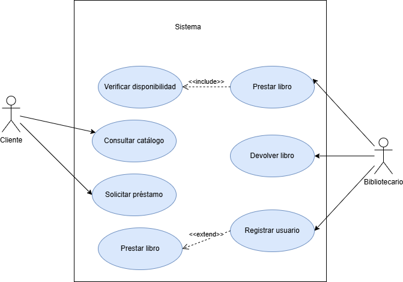
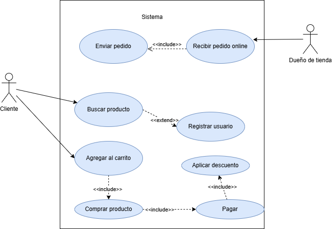
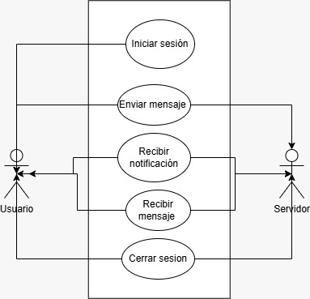
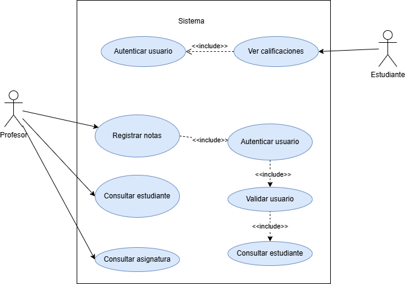
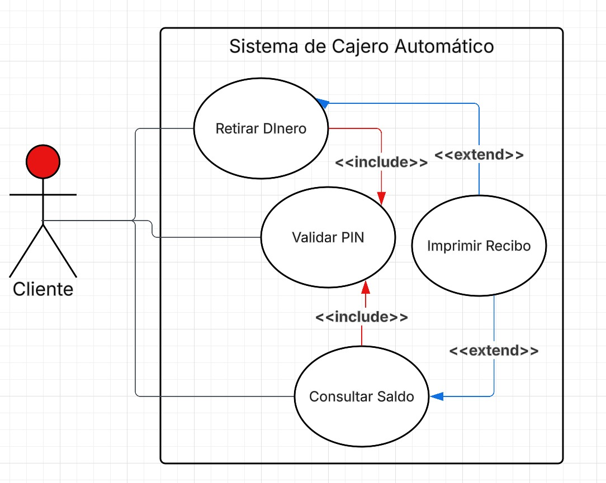
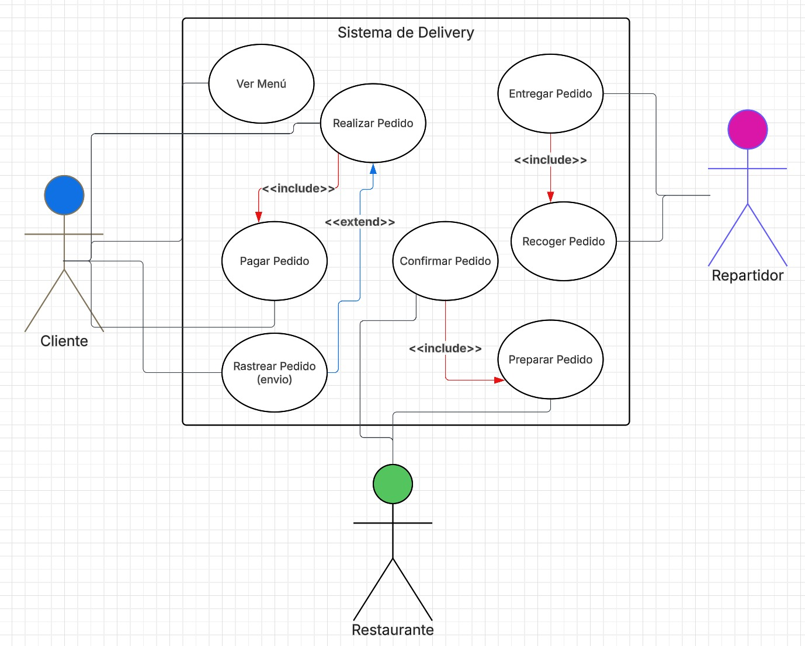
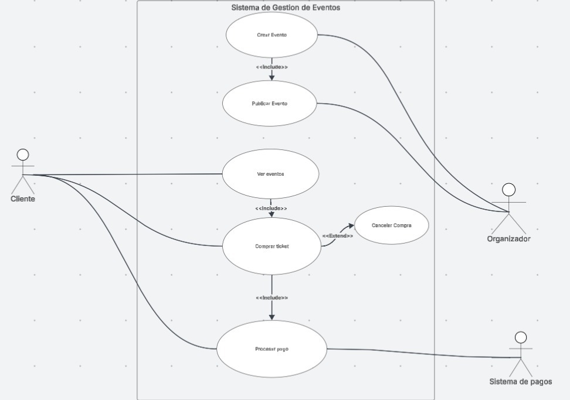
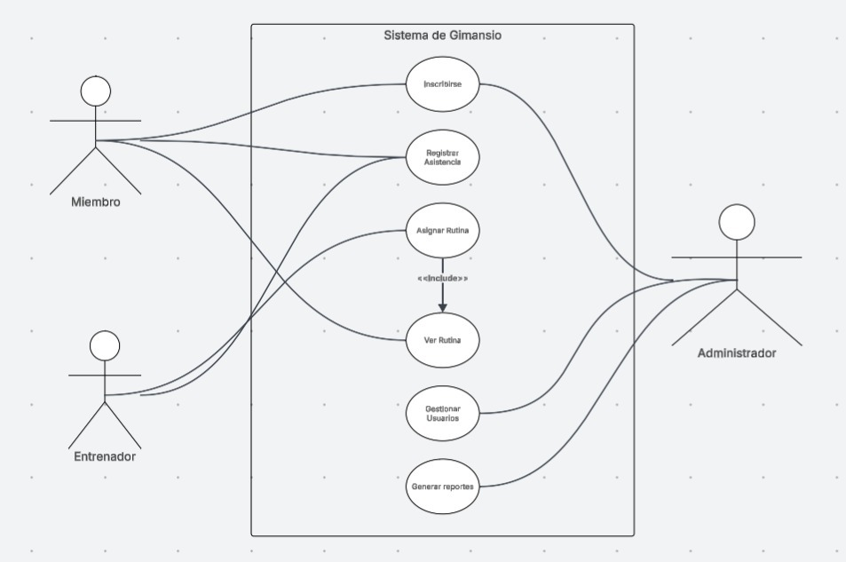
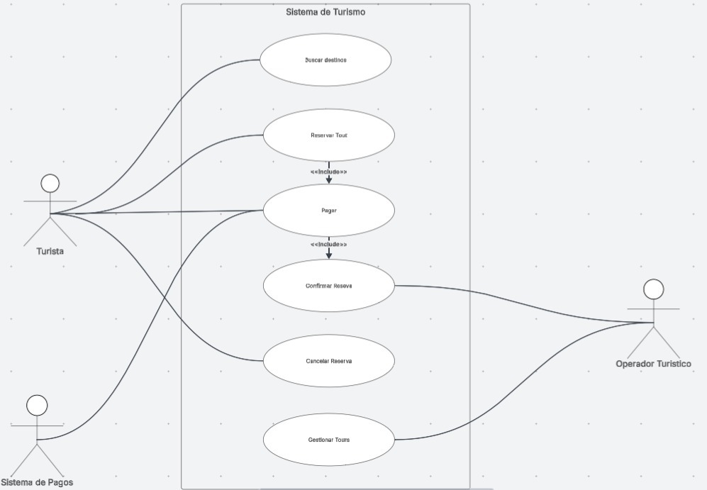

# Taller Grupal - Casos de uso
## Integrantes: Jhostin Molina, Emilia Peña y Fabio Tapia
### 1. Sistema de biblioteca

## Caso de uso: Prestar libro

| Elemento | Descripción |
|----------|-------------|
| ID | BIB-01 |
| Caso de uso | Prestar libro |
| Actores | Bibliotecario, Usuario |
| Propósito | Permitir registrar el préstamo de un libro a un usuario |
| Descripción | 1. El bibliotecario ingresa el ID del usuario. 2. El sistema verifica si el usuario está registrado. 3. El bibliotecario selecciona el libro. 4. El sistema verifica la disponibilidad del libro. 5. El sistema registra el préstamo. 6. El sistema actualiza el estado del libro. 7. El sistema muestra confirmación del préstamo. |
| Precondiciones | - Usuario registrado - Libro existente en el sistema |
| Postcondiciones | - Préstamo registrado - Libro marcado como no disponible |
| Extensiones síncronas | - Usuario no registrado → registrar usuario - Libro no disponible → mostrar mensaje |

### 2. Sistema de tienda online
| Elemento | Descripción |
| :--- | :--- |
| **ID** | TO01 |
| **Caso de uso** | Realizar compra de productos en línea |
| **Actores** | Cliente, Sistema de Inventario, Pasarela de Pagos |
| **Propósito** | Permitir al cliente seleccionar productos y finalizar la compra mediante un pago seguro. |
| **Descripción** | 1. El Cliente selecciona productos y los **Agrega al carrito**.   2. El Cliente inicia el proceso de **Pagar**.   3. El Sistema solicita los datos de facturación y envío.   4. El Cliente confirma el monto y procesa la transacción.   5. El Sistema confirma la compra y actualiza el inventario. |
| **Precondiciones** | El cliente ha iniciado sesión en su cuenta.   Los productos seleccionados tienen stock disponible.   El sistema de pagos está operativo. |
| **Postcondiciones** | La venta queda registrada en el sistema.   Se genera un comprobante de pago para el cliente.   El carrito de compras se vacía tras el éxito de la operación. |
| **Extensiones síncronas** | **Si el cliente desea Aplicar descuento:** El sistema valida el código antes de procesar el pago final.   **Si el pago es rechazado:** El sistema solicita un nuevo método de pago.   **Si el stock se agota durante el proceso:** El sistema notifica al cliente y actualiza el carrito. |

### 3. Sistema de chat

| Elemento | Descripción |
| :--- | :--- |
| **ID** | CH02 |
| **Caso de uso** | Gestionar intercambio de mensajes en tiempo real |
| **Actores** | Usuario Emisor, Usuario Receptor, Servidor de Chat, Servicio de Notificaciones |
| **Propósito** | Permitir la comunicación bidireccional entre usuarios mediante el envío y recepción de mensajes con alertas inmediatas. |
| **Descripción** | 1. El Usuario **Inicia sesión** en la aplicación.   2. El Usuario Emisor redacta y ejecuta la acción de **Enviar mensaje**.   3. El Servidor de Chat procesa el mensaje y lo entrega al destinatario.   4. El Usuario Receptor procede a **Recibir mensaje**.   5. El Sistema actualiza el estado del mensaje (enviado/recibido/leído). |
| **Precondiciones** | El usuario tiene una conexión a internet activa.   El usuario se ha autenticado correctamente.   El destinatario está en la lista de contactos del emisor. |
| **Postcondiciones** | El mensaje se almacena en el historial de chat de ambos usuarios.   El receptor visualiza el contenido del mensaje.   Se confirma la entrega al emisor. |
| **Extensiones síncronas** | **Si se requiere Incluir notificaciones:** El sistema genera una alerta visual/sonora en el dispositivo del receptor al detectar un mensaje nuevo.   **Si el inicio de sesión falla:** El sistema solicita verificar credenciales.   **Si el mensaje no se puede enviar:** El sistema muestra un icono de error y permite reintentar. |

### 4. Sistema de reservas de hotel

| Elemento | Descripción |
| :--- | :--- |
| **ID** | RH03 |
| **Caso de uso** | Gestionar reservas de habitaciones |
| **Actores** | Cliente, Recepcionista |
| **Propósito** | Permitir la gestión integral de alojamiento, desde la búsqueda hasta la gestión de cancelaciones y disponibilidad. |
| **Descripción** | 1. El Cliente procede a **Buscar habitación** por fechas.   2. El Cliente selecciona la opción de **Reservar**.   3. El Sistema solicita datos del cliente y garantía de pago.   4. El Recepcionista valida la reserva en el sistema.   5. El Cliente puede **Cancelar** su reserva si es necesario. |
| **Precondiciones** | El sistema de gestión hotelera está en línea.   Existe inventario de habitaciones cargado.   El Cliente cuenta con un método de contacto válido. |
| **Postcondiciones** | La disponibilidad de la habitación se actualiza en tiempo real.   Se emite una confirmación de reserva o cancelación. |
| **Extensiones sincrónicas** | **Si no hay disponibilidad:** El sistema ofrece fechas alternativas o tipos de habitación distintos.   **Si el Cliente desea Cancelar:** El sistema verifica si aplica penalización según la fecha.   **Si la garantía de pago falla:** La reserva queda en estado "pendiente" por tiempo limitado. |

### 5. Sistema Académico
| Elemento | Descripción |
| :--- | :--- |
| **ID** | CU04 |
| **Caso de uso** | Gestión de calificaciones académicas |
| **Actores** | Docente, Estudiante, Administrador del Sistema |
| **Propósito** | Facilitar el control y la transparencia en el registro y consulta de los resultados académicos. |
| **Descripción** | 1. El Docente accede al curso correspondiente.   2. El Docente procede a **Registrar notas** de las evaluaciones.   3. El Sistema valida y guarda las calificaciones en la base de datos.   4. El Estudiante accede a su perfil para **Ver calificaciones**.   5. El Sistema muestra el promedio actualizado al estudiante. |
| **Precondiciones** | El periodo académico se encuentra activo.   Los estudiantes están matriculados en las asignaturas.   El docente tiene permisos de edición sobre el curso. |
| **Postcondiciones** | Las notas quedan asentadas permanentemente en el historial académico.   El promedio final se recalcula automáticamente. |
| **Extensiones sincrónicas** | **Si la nota es inválida (fuera de rango):** El sistema bloquea el guardado y solicita corregir el dato.   **Si el plazo de registro ha vencido:** El sistema deshabilita la opción de editar al docente.   **Si el Estudiante solicita revisión:** El sistema notifica al docente sobre la observación en la nota. |

### 6. Sistema de Cajero Automático
| Elemento | Descripción |
| :--- | :--- |
| **ID** | CU05 |
| **Caso de uso** | Realizar operaciones bancarias en cajero |
| **Actores** | Cliente, Servidor Bancario |
| **Propósito** | Permitir al cliente gestionar su dinero de forma segura mediante la validación de identidad. |
| **Descripción** | 1. El Cliente inserta su tarjeta en el cajero.   2. El Sistema solicita y procede a **Validar PIN**.   3. El Cliente selecciona la opción de **Retirar dinero** o **Consultar saldo**.   4. El Servidor Bancario autoriza la transacción tras verificar fondos.   5. El Sistema entrega el efectivo o muestra la información en pantalla. |
| **Precondiciones** | El cajero automático tiene conexión con el servidor central.   El cajero dispone de efectivo suficiente (para retiros).   La tarjeta del cliente está activa y no bloqueada. |
| **Postcondiciones** | El saldo de la cuenta se actualiza en el sistema bancario.   Se emite un comprobante de la operación si el cliente lo solicita.   La tarjeta es devuelta al finalizar. |
| **Extensiones sincrónicas** | **Si el PIN es incorrecto:** El sistema permite hasta 3 intentos antes de retener la tarjeta.   **Si no hay fondos suficientes:** El sistema notifica al cliente y cancela el retiro.   **Si hay falla de comunicación:** El sistema informa que no puede realizar la operación en ese momento. |

### 7.  Sistema de Delivery
| Elemento | Descripción |
| :--- | :--- |
| **ID** | CU06 |
| **Caso de uso** | Gestionar pedido de comida a domicilio |
| **Actores** | Cliente, Restaurante, Repartidor, Pasarela de Pagos |
| **Propósito** | Coordinar la compra, preparación y entrega de alimentos de manera eficiente entre las tres partes. |
| **Descripción** | 1. El **Cliente** selecciona el menú y realiza el pago.   2. El **Restaurante** recibe la orden y confirma la preparación.   3. El Sistema asigna un **Repartidor** disponible.   4. El **Repartidor** retira el pedido del establecimiento.   5. El **Repartidor** entrega el pedido al **Cliente** y finaliza el flujo. |
| **Precondiciones** | El Cliente tiene una cuenta activa y dirección registrada.   El Restaurante está dentro de su horario de atención.   Hay repartidores activos en la zona. |
| **Postcondiciones** | El Cliente recibe su comida.   El Restaurante y el Repartidor reciben el pago correspondiente.   El estado del pedido cambia a "Entregado". |
| **Extensiones sincrónicas** | **Si el Restaurante rechaza el pedido:** Se notifica al Cliente y se realiza el reembolso automático.   **Si no se encuentra Repartidor:** El sistema informa al Cliente sobre el retraso o cancela la orden.   **Si el Cliente no se encuentra en el domicilio:** El Repartidor contacta al soporte para gestionar la devolución o espera. |

### 8. Sistema de Gestión de Eventos
| Elemento | Descripción |
| :--- | :--- |
| **ID** | CU07 |
| **Caso de uso** | Gestionar creación y reserva de eventos |
| **Actores** | Organizador, Cliente, Sistema de Pagos |
| **Propósito** | Permitir la organización de eventos y la adquisición de entradas de forma centralizada. |
| **Descripción** | 1. El **Organizador** procede a **Crear evento** definiendo fecha y aforo.   2. El Cliente selecciona un evento y elige **Comprar ticket**.   3. El Sistema ejecuta la acción de **Verificar disponibilidad** (`<<include>>`).   4. El Cliente realiza el pago a través de la pasarela.   5. El Sistema genera y envía el ticket digital al Cliente. |
| **Precondiciones** | El Organizador tiene una cuenta verificada.   El evento debe ser publicado antes de permitir ventas.   El Cliente cuenta con un método de pago válido. |
| **Postcondiciones** | El ticket queda vinculado a la identidad del Cliente.   El stock de entradas disponibles se reduce automáticamente.   El Organizador recibe la notificación de la venta. |
| **Extensiones sincrónicas** | **Si no hay tickets disponibles:** El sistema informa al Cliente y ofrece unirse a una lista de espera.   **Si el pago es rechazado:** El proceso de compra se detiene y se libera la reserva temporal del asiento.   **Si el evento es cancelado:** El sistema inicia automáticamente el proceso de reembolso a todos los compradores. |

### 9. Sistema de Gimnasio
| Elemento | Descripción |
| :--- | :--- |
| **ID** | CU08 |
| **Caso de uso** | Gestión de membresías y control de acceso |
| **Actores** | Miembro, Recepcionista, Entrenador |
| **Propósito** | Administrar el ingreso de nuevos socios y llevar un control estricto de la asistencia a las instalaciones. |
| **Descripción** | 1. El prospecto solicita **Inscribirse** al gimnasio.   2. El Recepcionista registra los datos personales y el plan seleccionado.   3. El Sistema genera una credencial o código de acceso.   4. El Miembro procede a **Registrar asistencia** mediante el lector en la entrada.   5. El Entrenador puede consultar la asistencia para asignar rutinas. |
| **Precondiciones** | El sistema de base de datos está operativo.   El lector biométrico o de códigos está conectado.   Los planes de membresía están configurados en el sistema. |
| **Postcondiciones** | El nuevo Miembro queda activo en el sistema.   El registro de entrada queda grabado con fecha y hora exacta.   Se actualiza el contador de aforo del gimnasio. |
| **Extensiones sincrónicas** | **Si la membresía está vencida:** El sistema bloquea el acceso y notifica al Miembro.   **Si el Miembro ya está dentro:** El sistema genera una alerta por registro duplicado.   **Si no hay cupo en una clase específica:** El sistema ofrece anotarse en una lista de espera. |

### 10. Sistema de Turismo
| Elemento | Descripción |
| :--- | :--- |
| **ID** | CU09 |
| **Caso de uso** | Reservar y pagar tours turísticos |
| **Actores** | Turista, Agencia de Viajes, Pasarela de Pagos |
| **Propósito** | Permitir al usuario encontrar destinos, asegurar su cupo mediante una reserva y formalizar la compra con un pago confirmado. |
| **Descripción** | 1. El Turista utiliza la opción de **Buscar destinos** filtrando por fechas y lugar.   2. El Turista selecciona un paquete y elige **Reservar tour**.   3. El Sistema solicita los datos de los viajeros y procede a **Pagar**.   4. La Pasarela de Pagos procesa la transacción.   5. El Sistema genera una **Confirmación de reserva** automática enviada al correo del Turista. |
| **Precondiciones** | El destino seleccionado tiene cupos disponibles.   El Turista ha aceptado los términos y condiciones de cancelación.   La Pasarela de Pagos está integrada y operativa. |
| **Postcondiciones** | El cupo del tour queda bloqueado para el Turista.   Se emite un comprobante fiscal y un itinerario digital.   El estado del tour cambia a "Reservado y Pagado". |
| **Extensiones sincrónicas** | **Si el pago es rechazado:** La reserva no se confirma y el cupo se libera inmediatamente.   **Si no se recibe confirmación del operador:** El sistema pone la reserva en estado "Pendiente de validación".   **Si el Turista aplica un cupón:** El sistema recalcula el total antes de llamar al proceso de pago. |

