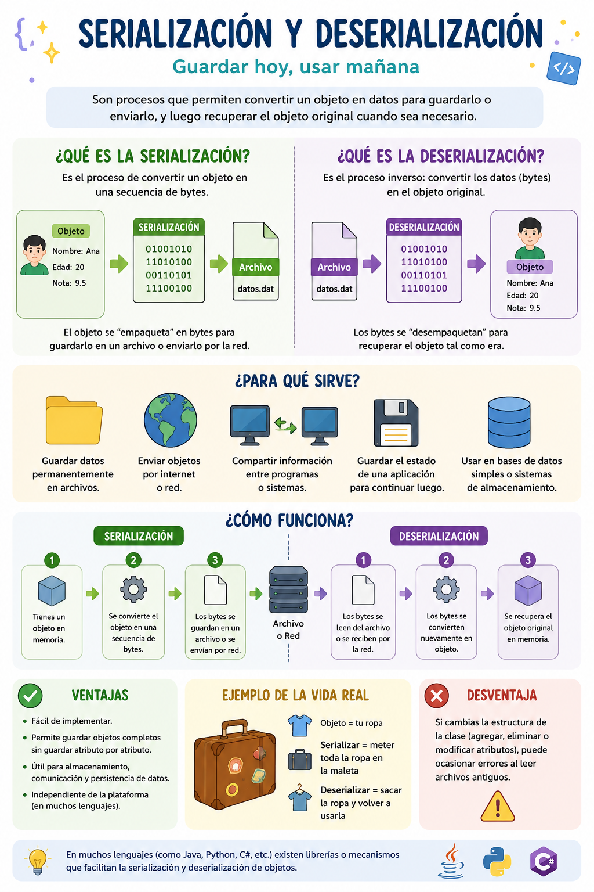

# Taller Grupal - Serialización de objetos
## Integrantes: José Maurad, Jhostin Molina, Emilia Peña y Fabio Tapia

## Infografía


# Implementación en Java
## 1. Clase Estudiante (Objeto serializable)

```java
import java.io.Serializable;

public class Estudiante implements Serializable {
    String nombre;
    int edad;

    public Estudiante(String nombre, int edad) {
        this.nombre = nombre;
        this.edad = edad;
    }

    public void mostrarDatos() {
        System.out.println("Nombre: " + nombre);
        System.out.println("Edad: " + edad);
    }
}
```

## 2. Serialización del objeto

```java
import java.io.FileOutputStream;
import java.io.ObjectOutputStream;

public class Serializar {
    public static void main(String[] args) {
        try {
            Estudiante e1 = new Estudiante("Emy", 20);

            FileOutputStream archivo = new FileOutputStream("datos.dat");
            ObjectOutputStream salida = new ObjectOutputStream(archivo);

            salida.writeObject(e1);
            salida.close();

            System.out.println("Objeto guardado correctamente.");
        } catch (Exception e) {
            System.out.println(e);
        }
    }
}

```

## 3. Deserialización del objeto
```java
import java.io.FileInputStream;
import java.io.ObjectInputStream;

public class Deserializar {
    public static void main(String[] args) {
        try {
            FileInputStream archivo = new FileInputStream("datos.dat");
            ObjectInputStream entrada = new ObjectInputStream(archivo);

            Estudiante e = (Estudiante) entrada.readObject();

            entrada.close();

            e.mostrarDatos();
        } catch (Exception e) {
            System.out.println(e);
        }
    }
}
```
