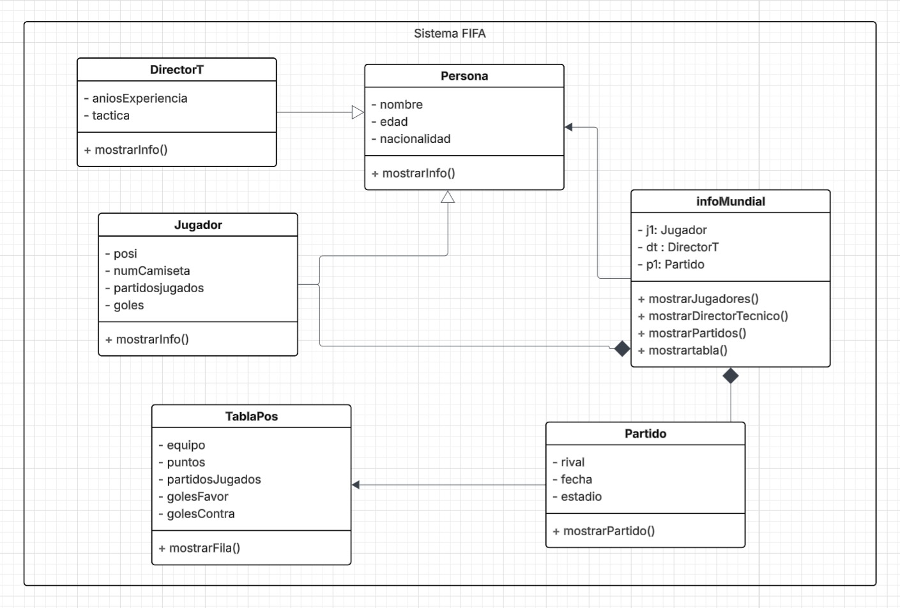
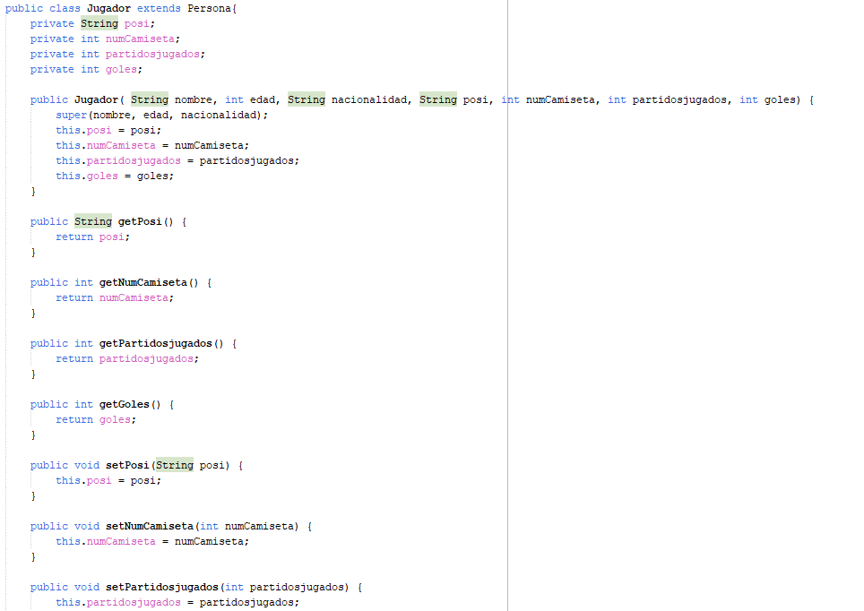
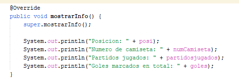
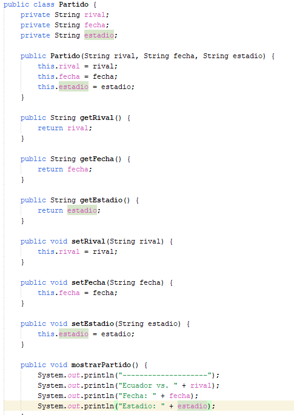
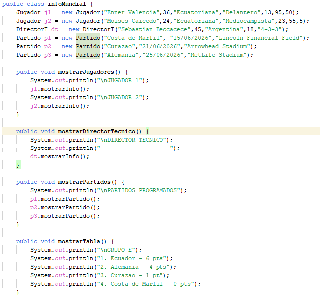
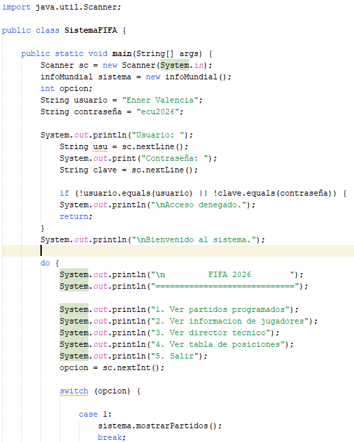
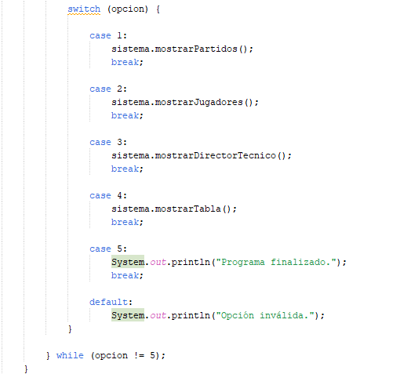
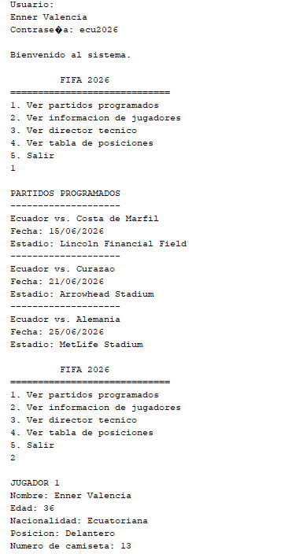
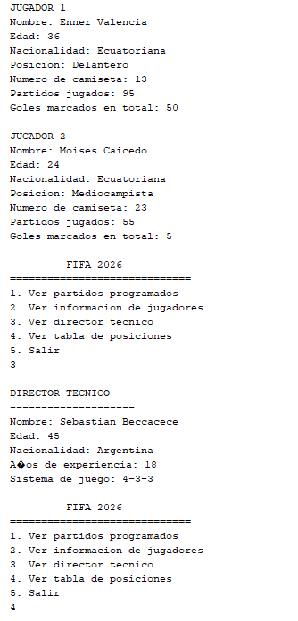
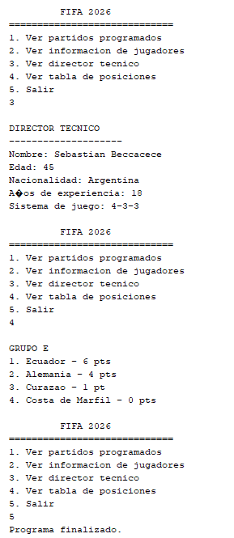

# TALLER GRUPAL - SISTEMA MUNDIAL 2026
## Integrantes: José Maurad, Jhostin Molina, Emilia Peña y Fabio Tapia.
---------------------------------------------------------------------------------
## Contexto 
Crear un sistema interno para que los integrantes de la selección puedan consultar información relevante del Mundial, como los partidos programados, los datos de los jugadores, el director técnico y la tabla de posiciones. Para garantizar que solo personas autorizadas accedan a la información, el sistema solicita un usuario y una contraseña antes de mostrar el menú principal.

## Descripción del proyecto
Durante el desarrollo se aplican los conceptos fundamentales de Programación Orientada a Objetos, especialmente:

- Clases y objetos
- Atributos y métodos
- Encapsulamiento
- Herencia
- Constructores
- Sobrescritura de métodos

## Diagrama UML

## Código

### Clase Persona

La clase `Persona` es la clase padre del sistema.

Contiene los atributos comunes que comparten las personas relacionadas con la selección (Jugador y Deportivo técnico). Sirve como base para otras clases que representan personas.

### Atributos

- nombre
- edad
- nacionalidad

### Métodos

- Constructor
- Getters y Setters
- mostrarInformacion()

---
### Clase Jugador
La clase `Jugador` hereda de la clase `Persona`. Gestiona la información relacionada con el director técnico.
Representa a un futbolista de la Selección Ecuatoriana. 

### Atributos

- posicion
- numeroCamiseta
- partidosJugados
- golesMarcados

### Métodos

- Constructor
- mostrarInformacion()

### Clase Director Tecnico

La clase `Director Tecnico` hereda de la clase `Persona`.
Representa al entrenador principal de la selección.

### Atributos

- aniosExperiencia
- sistemaJuego

### Métodos

- Constructor
- mostrarInformacion()

### Clase Partido
La clase `Partido` representa un encuentro programado para la selección. Muestra información sobre los partidos que tiene la Selección en el Mundial

### Atributos

- rival
- fecha
- estadio

### Métodos
- Constructor
- mostrarPartido()

### Clase infoMundial

La clase `infoMundial` centraliza la información del proyecto. Administra y muestra toda la información necesaria del programa (información de los jugadores, deportivo técnico, partidos y tabla de posiciones).
Aquí se crean los objetos correspondientes a:

- Jugadores
- Director técnico
- Partidos
- Tabla de posiciones

### Métodos

- mostrarJugadores()
- mostrarDirectorTecnico()
- mostrarPartidos()
- mostrarTabla()

### Clase Main

La clase `Main` es el punto de entrada del programa.
- Verifica el ingreso solo de usuarios registrados(jugadores de la Selección).
- Muestra el menú principal.
- Recibe las opciones del usuario.
- Invoca los métodos de la clase infoMundial.
- Controla la ejecución del programa.

### Aplicación de herencia: La herencia se implementa mediante la clase `Persona`. Gracias a la herencia, las clases hijas reutilizan los atributos: nombre, edad y nacionalidad sin necesidad de volver a declararlos.

### Aplicación del Encapsulamiento: Todos los atributos de las clases fueron declarados como privados (`private`). El acceso a dichos atributos se realiza mediante métodos públicos (getters y setters), garantizando la protección de los datos.

### Ejecución

##Evaluación al grupo 9
###Calificación: 9/10
