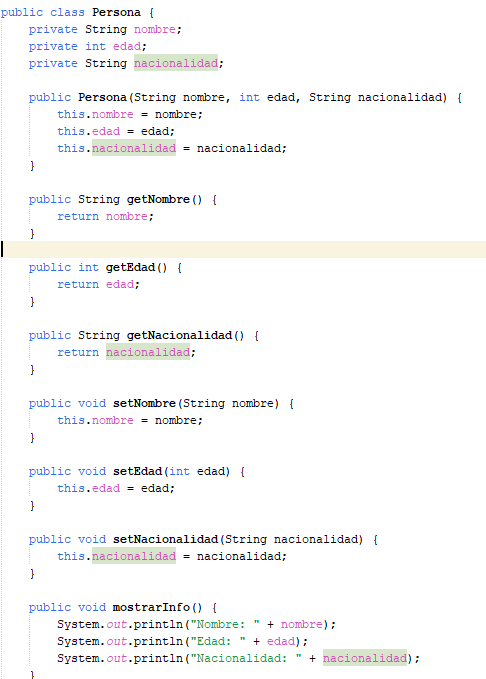

# TALLER GRUPAL - SISTEMA MUNDIAL 2026
## Integrantes: José Maurad, Jhostin Molina, Emilia Peña y Fabio Tapia.
---------------------------------------------------------------------------------
## Contexto 
Crear un sistema interno para que los integrantes de la selección puedan consultar información relevante del Mundial, como los partidos programados, los datos de los jugadores, el director técnico y la tabla de posiciones. Para garantizar que solo personas autorizadas accedan a la información, el sistema solicita un usuario y una contraseña antes de mostrar el menú principal.

## Descripción del proyecto
Durante el desarrollo se aplican los conceptos fundamentales de Programación Orientada a Objetos, especialmente:

- Clases y objetos
- Atributos y métodos
- Encapsulamiento
- Herencia
- Constructores
- Sobrescritura de métodos

## Diagrama UML

## Código

### Clase Persona

La clase `Persona` es la clase padre del sistema.

Contiene los atributos comunes que comparten las personas relacionadas con la selección (Jugador y Deportivo técnico)

### Atributos

- nombre
- edad
- nacionalidad

### Métodos

- Constructor
- Getters y Setters
- mostrarInformacion()

---

