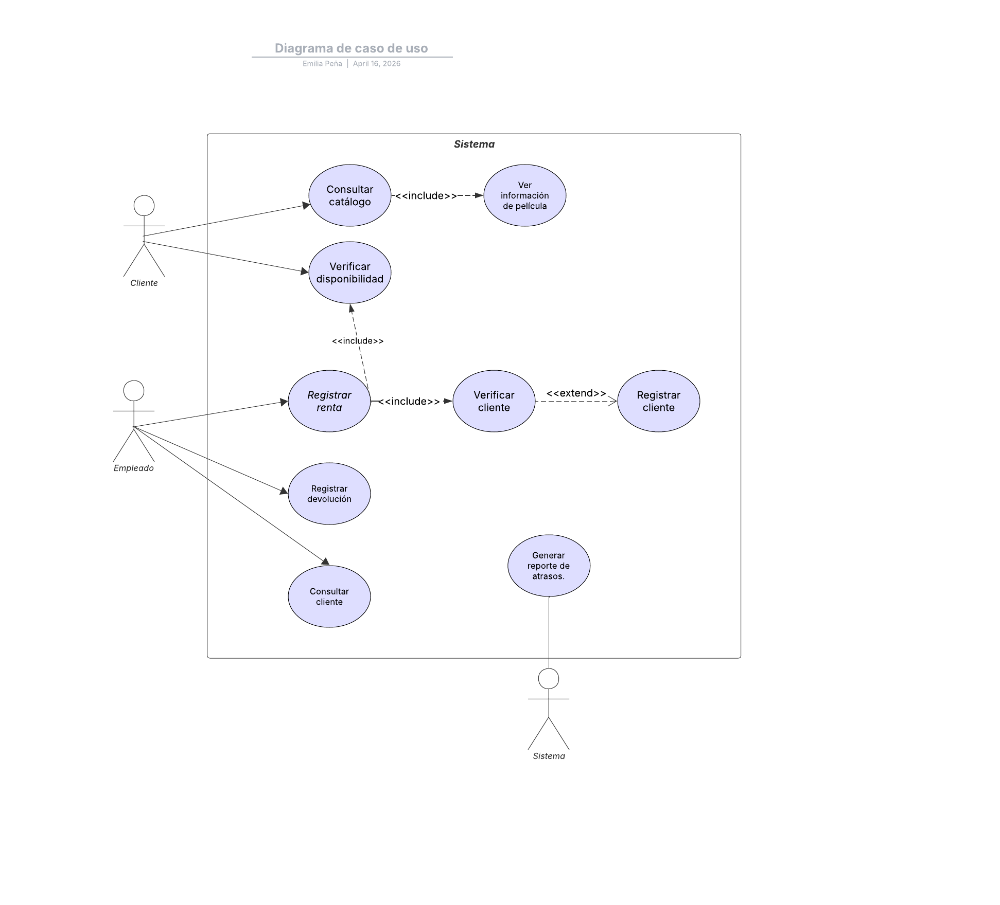
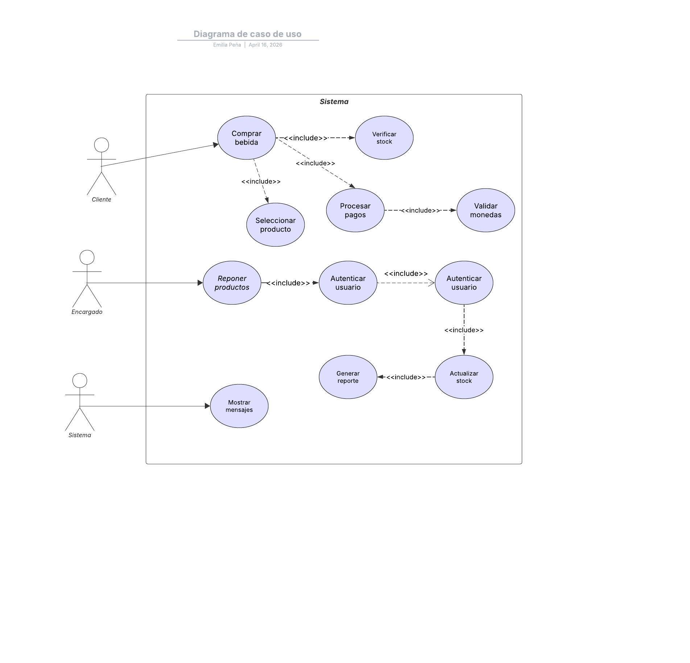

## Problema 1: Modelado de sistema de crédito en tienda de electrodomésticos

### Planteamiento

Un negocio de venta de electrodomésticos decidió implementar y otorgar una línea de crédito a sus clientes para la compra de productos.

Los créditos son solicitados por los clientes al vendedor al momento de realizar la compra y deben ser autorizados por un representante de la gerencia de créditos.  
El pago se realiza mediante débito automático en tarjetas de crédito.

Si el crédito se acepta, el producto se entrega al cliente de forma inmediata.

Cada mes se cobrará automáticamente el pago de las cuotas en la tarjeta del cliente.

Se desea modelar el proceso de:
- Solicitud de crédito  
- Otorgamiento de crédito  
- Pago del crédito  

### Indicaciones

- Represente todo el proceso completo como un único caso de uso, mencionando sus pasos principales, sin detallar alternativas.  

- Identifique los distintos actores que intervienen en el proceso.  

- Identifique casos de uso derivados del proceso principal.  

- Identifique nuevos casos de uso considerando variaciones, casos previos, posteriores o alternativos.  

- Identifique casos de uso reutilizables que puedan ser incluidos en otros casos.

## Caso de uso: Gestionar crédito

| Elemento | Descripción |
|----------|-------------|
| ID | V-01 |
| Caso de uso | Gestionar crédito para compra |
| Actores | Cliente, Vendedor, Representante de créditos, Sistema bancario |
| Propósito | Permitir solicitar, aprobar y pagar un crédito para comprar productos |
| Descripción | 1. El cliente selecciona producto. 2. Solicita crédito al vendedor. 3. El vendedor registra la solicitud. 4. Se envía al representante. 5. Se evalúa el crédito. 6. Se aprueba el crédito. 7. Se registra en el sistema. 8. Se configura débito automático. 9. Se autoriza entrega. 10. Se entrega producto. 11. Se cobran cuotas mensuales automáticamente. |
| Precondiciones | - Sistema activo - Cliente con tarjeta válida - Producto disponible |
| Postcondiciones | - Crédito aprobado - Producto entregado - Pagos configurados |
| Extensiones síncronas | - No se apueba el crédito.  - El cliente no está registrado. |

## Problema 2: Modelado de diagrama de casos de uso de una cadena de videoclubes

### Planteamiento

La famosa cadena de videoclubes “Los Bloques de Búster” nos ha contratado con el fin de desarrollar un sistema para sistematizar sus locales.

Hasta el día de hoy se han mantenido una serie de reuniones con el cliente con el fin de determinar los requerimientos del sistema. De tales reuniones, se ha determinado lo siguiente:

- El sistema deberá permitir que los clientes consulten el catálogo de películas.  
  A partir del mismo, una vez seleccionada una película, se deberá poder acceder a la información de la misma como ser su clasificación, su género y un breve resumen.  
  Asimismo, opcionalmente, se deberá poder consultar la disponibilidad del video.

- Los empleados del videoclub deberán poder, a través del sistema, registrar las rentas y devoluciones por parte de los clientes, y consultar, dado un cliente, los videos que éste posea en renta.  
  Si registrando una renta, resulta que el cliente no se encuentra registrado, el sistema deberá permitir que se efectúe su alta.

- El sistema deberá generar automáticamente un informe todas las mañanas a las 9:00 a.m. que muestre todos los clientes que se encuentran atrasados con sus devoluciones.

## Caso de uso: Registrar renta de película

| Elemento | Descripción |
|----------|-------------|
| ID | BB-02 |
| Caso de uso | Registrar renta de película |
| Actores | Empleado |
| Propósito | Permitir registrar el préstamo de una película a un cliente |
| Descripción | 1. El sistema solicita el ID del cliente. 2. El empleado ingresa los datos. 3. El sistema verifica si el cliente existe. 4. Si no existe, se solicita su registro. 5. El empleado registra al cliente. 6. El sistema muestra el catálogo. 7. El empleado selecciona la película. 8. El sistema verifica disponibilidad. 9. El empleado confirma la renta. 10. El sistema registra la renta. 11. Se actualiza el stock. 12. Se muestra confirmación. |
| Precondiciones | - Sistema operativo - Catálogo disponible - Empleado autenticado |
| Postcondiciones | - Renta registrada - Película no disponible |
| Extensiones síncronas | - Cliente no registrado → registrar cliente - Película no disponible → mostrar mensaje - Cancelación → finalizar proceso |

## Problema 3: Modelado de máquina expendedora de bebidas

### Planteamiento

Se ha decidido fabricar una máquina para la expedición y venta de bebidas en forma automática.

El cliente selecciona algunos de los productos ofrecidos, uno o más, por medio de la pulsación de botones.  
Los artículos pueden ser de distintos tipos: latas de refresco, jugos o botellas.

Solamente se puede solicitar un tipo de producto a la vez.  
La máquina reconoce el pedido del cliente.  
Si no hay en existencia, le indica al cliente por medio de un mensaje.

La máquina acepta las monedas del cliente, reconociendo distintos tipos.  
Si las monedas no cubren el total del importe, las devuelve y le avisa al cliente mediante un mensaje.  
En caso contrario, libera las bebidas solicitadas, actualiza el stock de productos e imprime un ticket.

El encargado de la reposición repone los artículos de acuerdo a lo indicado en la pantalla.  
Para ello, accede mediante una contraseña a una interfaz propia.

Al realizar la reposición:
- Debe indicar el producto  
- Debe indicar la cantidad repuesta  

El sistema:
- Actualiza el stock  
- Emite un resumen de faltantes  
- Imprime dos copias (constancia y factura)

## Caso de uso: Comprar bebida

| Elemento | Descripción |
|----------|-------------|
| ID | MACH-03 |
| Caso de uso | Comprar bebida |
| Actores | Cliente |
| Propósito | Permitir al cliente comprar una bebida automáticamente |
| Descripción | Flujo principal: 1. El cliente selecciona una bebida. 2. El sistema registra la selección. 3. Se verifica disponibilidad. 4. Se solicita el pago. 5. El cliente introduce monedas. 6. El sistema valida las monedas. 7. Se calcula el total. 8. Si es suficiente, se procesa la compra. 9. Se entrega el producto. 10. Se actualiza el stock. 11. Se imprime ticket. |
| Precondiciones | - Máquina encendida - Producto disponible |
| Postcondiciones | - Producto entregado - Stock actualizado - Ticket generado |
| Extensiones síncronas | - Sin stock → mensaje - Pago insuficiente → devolución - Moneda inválida → rechazo |

## Caso de uso: Reponer productos

| Elemento | Descripción |
|----------|-------------|
| ID | MACH-03 |
| Caso de uso | Reponer productos |
| Actores | Encargado |
| Propósito | Permitir la reposición de productos en la máquina |
| Descripción | 1. El encargado inicia sesión con contraseña. 2. El sistema valida acceso. 3. Se muestran productos con bajo stock. 4. Se selecciona producto. 5. Se ingresa cantidad. 6. Se actualiza stock. 7. Se genera reporte. 8. Se imprimen copias. |
| Precondiciones | - Encargado autorizado - Sistema activo |
| Postcondiciones | - Stock actualizado - Reporte generado |
| Extensiones síncronas | - Contraseña incorrecta → acceso denegado - Error en datos → solicitar nuevamente |

