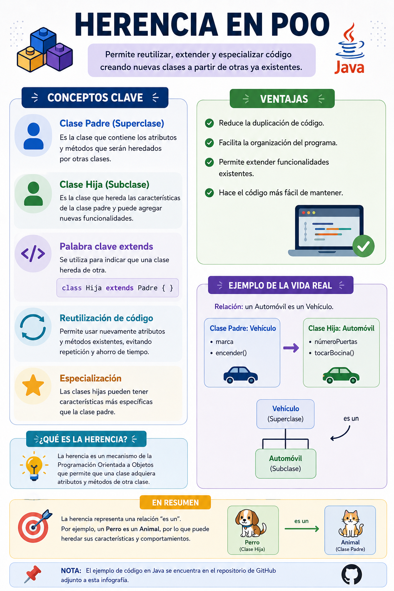

# Herencia



## Clase Padre: Persona

```java
public class Persona {

    String nombre;

    public Persona(String nombre) {
        this.nombre = nombre;
    }

    public void saludar() {
        System.out.println("Hola, soy " + nombre);
    }
}
```

## Clase Hija: Estudiante

```java
public class Estudiante extends Persona {

    public Estudiante(String nombre) {
        super(nombre);
    }

    public void hacerTarea() {
        System.out.println(nombre + " está haciendo la tarea");
    }
}
```

## Clase Principal

```java
public class Main {

    public static void main(String[] args) {

        Estudiante e = new Estudiante("María");

        e.saludar();
        e.hacerTarea();
    }
}
```

## Salida

```text
Hola, soy María
María está haciendo la tarea
```

## Explicación

- `Persona` es la clase padre.
- `Estudiante` es la clase hija.
- `Estudiante` hereda el atributo `nombre`.
- `Estudiante` hereda el método `saludar()`.
- `Estudiante` agrega el método `hacerTarea()`.

### Relación "es un"

Un **Estudiante es una Persona**.
