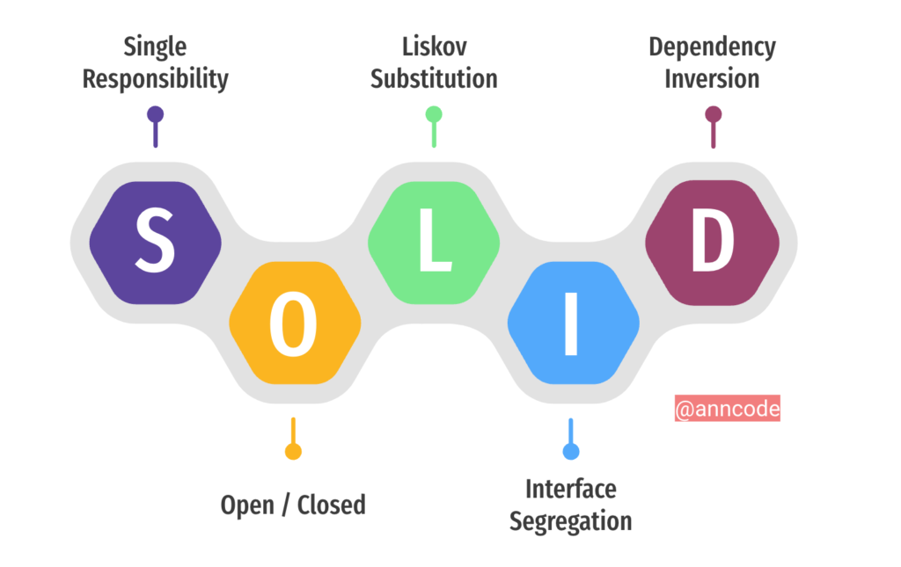

# Principios S.O.L.I.D
Conjunto de cinco principios de diseño orientados a objetos que ayudan a crear software más flexible, mantenible y fácil de extender. 

# Principios SOLID en Java y Python

## 1. Single Responsibility Principle (SRP)

- Una clase debe tener una única responsabilidad o motivo para cambiar.

**Identificar error**

En este ejemplo la clase tiene dos responsabilidades: generar reportes y guardar archivos. Si cambia la lógica de almacenamiento, también debe modificarse esta clase.

```java
class Reporte {

    public void generarReporte() {
        System.out.println("Generando reporte...");
    }

    public void guardarArchivo() {
        System.out.println("Guardando archivo...");
    }
}
```

```python
class Reporte:
    def generar(self):
        print("Generando reporte")

    def guardar(self):
        print("Guardando archivo")
```

- **Solución en Java**

```java
class Reporte {
    public void generarReporte() {
        System.out.println("Generando reporte...");
    }
}

class GuardadorReporte {
    public void guardarArchivo() {
        System.out.println("Guardando archivo...");
    }
}
```

- **Solución en Python**

```python
class Reporte:
    def generar(self):
        print("Generando reporte")

class GuardadorReporte:
    def guardar(self):
        print("Guardando archivo")
```

---

## 2. Open/Closed Principle (OCP)

- Las clases deben estar abiertas para extensión pero cerradas para modificación.

**Identificar error**

Cada vez que se necesite agregar un nuevo tipo de descuento será necesario modificar la clase, aumentando el riesgo de errores y dificultando el mantenimiento.

```java
class CalculadoraDescuento {

    public double calcular(String tipo, double precio) {

        if(tipo.equals("ESTUDIANTE")) {
            return precio * 0.8;
        }

        if(tipo.equals("VIP")) {
            return precio * 0.7;
        }

        return precio;
    }
}
```

```python
class Calculadora:

    def calcular(self, tipo, precio):

        if tipo == "ESTUDIANTE":
            return precio * 0.8

        if tipo == "VIP":
            return precio * 0.7

        return precio
```

- **Solución en Java**

```java
interface Descuento {
    double aplicar(double precio);
}

class DescuentoEstudiante implements Descuento {
    public double aplicar(double precio) {
        return precio * 0.8;
    }
}

class DescuentoVIP implements Descuento {
    public double aplicar(double precio) {
        return precio * 0.7;
    }
}
```

- **Solución en Python**

```python
class Descuento:
    def aplicar(self, precio):
        pass

class DescuentoEstudiante(Descuento):
    def aplicar(self, precio):
        return precio * 0.8

class DescuentoVIP(Descuento):
    def aplicar(self, precio):
        return precio * 0.7
```

---

## 3. Liskov Substitution Principle (LSP)

- Una subclase debe poder reemplazar a su clase padre sin alterar el funcionamiento del programa.

**Identificar error**

La clase `Pinguino` hereda de `Ave`, pero no puede cumplir correctamente con el comportamiento esperado de volar. Esto rompe la sustitución entre la clase padre y la hija.

```java
class Ave {
    public void volar() {
        System.out.println("Volando");
    }
}

class Pinguino extends Ave {

    @Override
    public void volar() {
        throw new UnsupportedOperationException();
    }
}
```

```python
class Ave:

    def volar(self):
        print("Volando")

class Pinguino(Ave):

    def volar(self):
        raise Exception("No puedo volar")
```

- **Solución en Java**

```java
class Ave {
}

interface Voladora {
    void volar();
}

class Aguila extends Ave implements Voladora {

    public void volar() {
        System.out.println("Volando");
    }
}

class Pinguino extends Ave {
}
```

- **Solución en Python**

```python
class Ave:
    pass

class Voladora:

    def volar(self):
        pass

class Aguila(Ave, Voladora):

    def volar(self):
        print("Volando")

class Pinguino(Ave):
    pass
```

---

## 4. Interface Segregation Principle (ISP)

- Ninguna clase debe verse obligada a implementar métodos que no necesita.

**Identificar error**

La interfaz obliga al robot a implementar el método `comer()`, aunque un robot no necesita ni puede comer.

```java
interface Trabajador {

    void trabajar();

    void comer();
}

class Robot implements Trabajador {

    public void trabajar() {
        System.out.println("Trabajando");
    }

    public void comer() {
        throw new UnsupportedOperationException();
    }
}
```

```python
class Trabajador:

    def trabajar(self):
        pass

    def comer(self):
        pass

class Robot(Trabajador):

    def trabajar(self):
        print("Trabajando")

    def comer(self):
        raise Exception("No come")
```

- **Solución en Java**

```java
interface Trabajador {
    void trabajar();
}

interface Comedor {
    void comer();
}

class Humano implements Trabajador, Comedor {

    public void trabajar() {
        System.out.println("Trabajando");
    }

    public void comer() {
        System.out.println("Comiendo");
    }
}

class Robot implements Trabajador {

    public void trabajar() {
        System.out.println("Trabajando");
    }
}
```

- **Solución en Python**

```python
class Trabajador:

    def trabajar(self):
        pass

class Comedor:

    def comer(self):
        pass

class Humano(Trabajador, Comedor):

    def trabajar(self):
        print("Trabajando")

    def comer(self):
        print("Comiendo")

class Robot(Trabajador):

    def trabajar(self):
        print("Trabajando")
```

---

## 5. Dependency Inversion Principle (DIP)

- Los módulos de alto nivel no deben depender de módulos de bajo nivel. Ambos deben depender de abstracciones.

**Identificar error**

La clase `Aplicacion` depende directamente de `MySQL`. Si en el futuro se desea cambiar a otra base de datos, será necesario modificar la aplicación.

```java
class MySQL {

    public void conectar() {
        System.out.println("Conectado a MySQL");
    }
}

class Aplicacion {

    private MySQL db = new MySQL();

    public void iniciar() {
        db.conectar();
    }
}
```

```python
class MySQL:

    def conectar(self):
        print("Conectado a MySQL")

class Aplicacion:

    def __init__(self):
        self.db = MySQL()

    def iniciar(self):
        self.db.conectar()
```

- **Solución en Java**

```java
interface BaseDatos {
    void conectar();
}

class MySQL implements BaseDatos {

    public void conectar() {
        System.out.println("Conectado a MySQL");
    }
}

class Aplicacion {

    private BaseDatos db;

    public Aplicacion(BaseDatos db) {
        this.db = db;
    }

    public void iniciar() {
        db.conectar();
    }
}
```

- **Solución en Python**

```python
class BaseDatos:

    def conectar(self):
        pass

class MySQL(BaseDatos):

    def conectar(self):
        print("Conectado a MySQL")

class Aplicacion:

    def __init__(self, db):
        self.db = db

    def iniciar(self):
        self.db.conectar()
```

